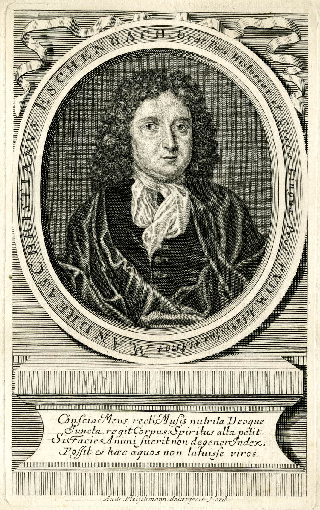

#### Andreas Christian Eschenbach (March 24, 1663 - September 25, 1722)

[German Bio](#german-bio)  
[English Bio](#english)

##### German Bio

from [*Allgemeine Deutsche Biographie*](https://de.wikisource.org/wiki/ADB:Eschenbach,_Andreas_Christian)

Eschenbach: Andreas Christian E., Theologe und Philologe, geb. am 24. März 1663, † am 25. Septbr. 1722. In der Nürnberger Vorstadt Wöhrd, wo sein Vater Pfarrer war, geboren, widmete er sich, auf dem Gymnasium Aegidianum in Nürnberg vorgebildet, während dreier Jahre zu Altdorf vorzugsweise philologischen und allgemein wissenschaftlichen Studien, begab sich aber 1685 auf den Wunsch seines Vaters nach Jena, um nun mit allem Ernst Theologie zu studiren. Doch scheint er dabei den Beruf des akademischen Docenten ins Auge gefaßt zu haben, wie er denn in der That im J. 1687 unter die Adjuncten der Jenaer philosophischen Facultät aufgenommen wurde und als solcher Vorlesungen an der Universität hielt. In dem folgenden Jahre unternahm er eine wissenschaftliche Reise, um sich zunächst mit den handschriftlichen Schätzen der Bibliotheken in Wittenberg, Helmstädt und Wolfenbüttel bekannt zu machen und sodann längere Zeit in Holland zu verweilen. Während seines Aufenthaltes in Utrecht besorgte er eine Gesammtausgabe der Orphischen Dichtungen („Orphei Argonautica, hymni et de lapidibus“ 1689). In seine Geburtsstadt zurückgekehrt, leistete er seinem einer Stütze bedürfenden Vater bis zu dessen Tode (Dec. 1690) im Predigtamte und anderen geistlichen Verrichtungen Beistand. Es war dies für ihn eine Zeit schwerer Kämpfe und innerer Anfechtungen, da es ihm nicht gelingen wollte, über den durch seine bisherigen Studien genährten Skepticismus hinwegzukommen und sich zur freudigen Zuversicht des christlichen Glaubens emporzuringen. Als er daher von Florenz durch den Vorstand der Laurentiana, Antonio Magliabechi, eine Einladung erhielt, an dieser Bibliothek eine Dienstesstelle zu übernehmen, war er nicht abgeneigt, dem Rufe zu folgen, zog es aber hernach doch vor, das ihm zu gleicher Zeit von den Nürnberger Scholarchen angetragene Inspectorat der Alumneumsstiftung in Altdorf zu übernehmen, besonders weil man ihm hiebei die Aussicht auf die nächste Professur, welche sich in der philosophischen Facultät erledigen würde, eröffnete. Diese Zusicherung sollte sich indessen wenigstens in der gegebenen Weise nicht erfüllen, indem er 1694 ohne sein Zuthun nach Nürnberg an das Diaconat der Marienkirche berufen, aber zugleich zum Professor Eloquentiae, Poeseos, Historiarum et Graecae linguae an dem Auditorium Aegidianum (eine Art Lycealcurs für die gereifteren Schüler des Gymnasiums, der noch bis Ende des vorigen Jahrhunderts in Nürnberg bestand) ernannt wurde. In letzterer Eigenschaft war er hauptsächlich für die Hebung des damals ziemlich vernachlässigten Studiums der griechischen Sprache thätig; zu diesem Zweck veranstaltete er eine Ausgabe von „Matthaei Devarii de graecis particulis liber“, 1700. In einer dem König Friedrich I. von Preußen gewidmeten Schrift, „Epigenes de poesi Orphica; in priscas Orphicorum carminum memorias liber commentarius“, 1702, hat er, wenn auch seine Kritik viel zu wünschen übrig läßt (vgl. Lobeck Aglaoph. S. 962), doch jedenfalls den ersten Anstoß zu einer genaueren Untersuchung dieser Poesien gegeben. Außer zahlreichen Programmen und Dissertationen erschien von ihm noch ein Band Predigten und nach seinem Tode fand sich unter seinem handschriftlichen Nachlaß eine freie deutsche Bearbeitung der „Sermons“ des französischen Jesuiten P. Claude la Colombière über die letzten Dinge und eine kurz vor seinem Lebensende niedergeschriebene Selbstbiographie. Beide [338] Schriften wurden nach der Hand in einem Bande mit dem Titel „A. Ch. Eschenbach’s Betrachtung des Endes“ (Nürnberg 1729) durch den Druck veröffentlicht und lassen erkennen, daß er auch in seinen theologischen Bedenken einen vollkommen befriedigenden Abschluß gefunden hatte.

##### English

from [McClintock & Strong's Cyclopedia of Biblical, Theological and Ecclesiastical Literature](https://www.google.com/books/edition/Cyclop%C3%A6dia_of_Biblical_Theological_and/2whLAQAAMAAJ?hl=en&gbpv=1&dq=andreas+christian+eschenbach+de+poetis+christianis&pg=PA350&printsec=frontcover) (1870)

a German divine and philologist, was born at Nuremberg, March 24, 1663, and was educated at Altdorf, where, in 1684, he received the poetic crown. He went to Jena and taught the classics with considerable reputation. He travelled through Germany and Holland, and on his return assisted his father in the Church of Wehrd, in Nuremberg. In 1691 he was appointed inspector of the schools of Altdorf, and in 1695 was recalled to Nuremberg as deacon of the Church of St. Mary, and professor of eloquence, poetry, history, and the Greek language in St. Giles's College, to which office, in 1705 was added that of pastor of St. Clare. He died September 24, 1722. Someof his philological dissertations were printed in 1700, in, the Syntagma Secundum Dissertationum Philologicarum (Rotterdam, 8vo). His Epigenes sive Commentarius in Fragmenta Orphica, was published at Nuremberg (1702, 4to). He translated into German, Allix on The Truth of the Christian Religion, and on The Coming of the Messiah. See Chalmers, Biog. Dict. s.v.; Jocher, Allgemeines Gelehrten-Lexikon, s.v.
